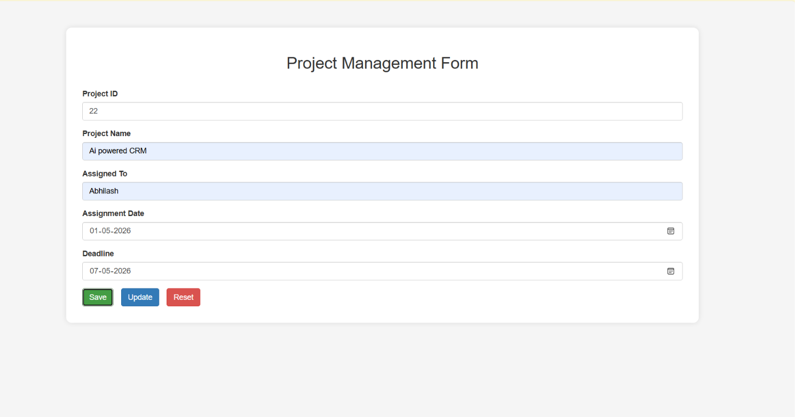
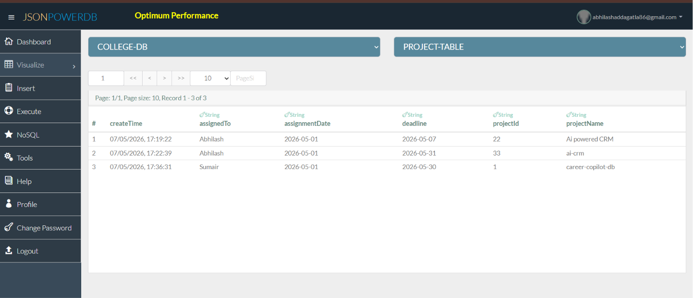

# Project Management Form using JsonPowerDB

## Description

This project is a Project Management Form developed using HTML, CSS, JavaScript, Bootstrap, and JsonPowerDB.

The application allows users to:
- Store new project records
- Update existing project records
- Reset form data
- Validate project records using primary key

The project uses JsonPowerDB as the backend database for fast and lightweight data storage.

---

## Features

- Save Project Data
- Update Existing Records
- Reset Form
- Primary Key Validation
- Dynamic Form Control
- JsonPowerDB Integration
- Responsive UI using Bootstrap

---

## Input Fields

- Project ID
- Project Name
- Assigned To
- Assignment Date
- Deadline

### Primary Key
- Project ID

---

## Technologies Used

- HTML5
- CSS3
- JavaScript
- Bootstrap
- JsonPowerDB
- jQuery

---

## Benefits of using JsonPowerDB

- Simple and easy to use
- Lightweight database
- High performance
- REST API based
- Serverless support
- Fast development
- Schema-free database
- Easy integration with frontend applications

---

## Project Screenshots

### Project Form UI

---

### Database Records Stored in JsonPowerDB

---

## Project Flow

1. User enters Project ID
2. If Project ID does not exist:
   - Save and Reset buttons enabled
   - User can enter project details
3. If Project ID exists:
   - Existing data auto-fills
   - Update and Reset buttons enabled
4. User can save or update project information
5. Reset clears the form

---

## Release History

### v1.0.0
- Initial release of Project Management Form
- Added Save functionality
- Added Update functionality
- Added Reset functionality
- Integrated JsonPowerDB
- Added form validation
- Added primary key checking

---

## Project Status

Project completed successfully.

---

## Sources

- JsonPowerDB Documentation
- Login2Xplore Course Material
- Bootstrap Documentation
- jQuery Documentation

---

## Author

### Abhilash Addagatla

B.Tech CSE (AIML)  
Jayamukhi Institute of Technological Sciences